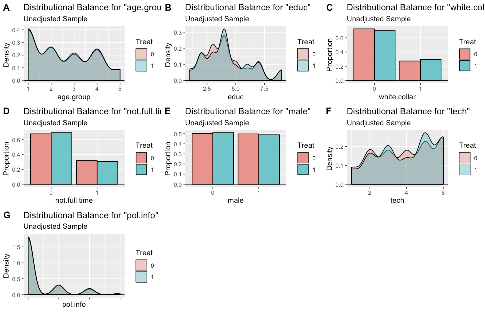
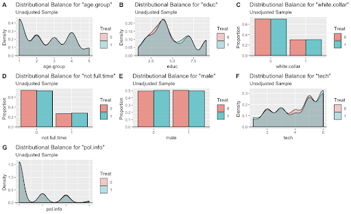
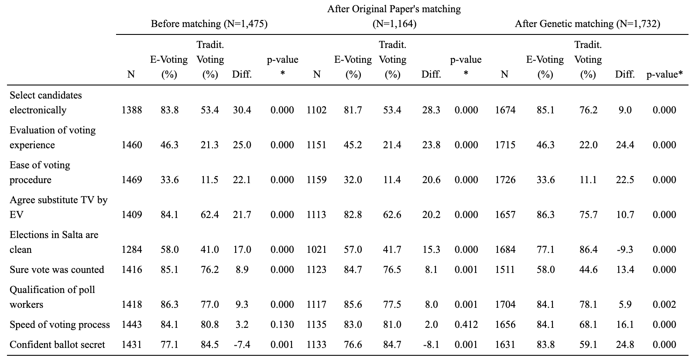

# Evaluation of E-voting as an Alternate System for Improving the Voters’ Experience

## Executive summary

There have been growing discussions about the impact of various voting technologies on the voting experience. One controversial debate is whether e-voting processes improve the legitimacy of the election process and the general voting experience. In their paper, ‘Voting Made Safe and Easy: The impact of e-voting on Citizen Perceptions’, Alvarez et. al use propensity score matching methods to measure the causal effect of replacing traditional voting technology with e-voting on the voting experience in Argentina. Extending their results using a genetic matching procedure, we were able to obtain a high degree of treatment/control-group balance on nearly all the covariates without discarding any of the treated units (as against Alvarez et. al, who discarded 284 treated units (32.8%) of the 866 treated units). Our results suggest that e-voters perceive the new technology as more efficient, easier to use, and more likely to register votes as intended. They also support replacing traditional voting with e-voting, showing more confidence in ballot secrecy than traditional voters. This contradicts the original paper’s finding regarding ballot secrecy. 

-----

## Discussion of the Original Paper
The original paper employs propensity score caliper matching to approximate a randomized field experiment by closely matching voters who used the traditional voting procedure to similar e-voters. The balance statistics produced from the original paper (Table 2 in the original paper) are shown below:

The matching procedure resulted in the discarding of 311 units (284 treated units and 27 control units). The discarding of 284 (32.8%) of the 866 treated units could especially bias the causal estimates as it represents a significant portion of the treated units. We also present a plot of the balance on covariates achieved by the original paper's matching procedure:

# Genetic Matching

Genetic matching was carried out on the same covariates that were used to compute the propensity scores in the original paper. These included quadratic and interaction terms:

age.group, I(age.group^2), I(age.group^3), age.group:educ, age.group:tech, educ, I(educ^2), tech, I(tech^2), pol.info, educ:pol.info, age.group:pol.info, tech:pol.info, white.collar, not.full.time, male.

The implemented genetic matching run involved a population size of 2000 as well as setting ties to FALSE. The minimim p-value obtained for this run, was 0.11048 for age.group:educ. This suggests that there was high balance on all covariates, even age.group:educ.

We present plots to visualize the balance on covariates obtained through genetic matching:

From the figure above, we see a significant improve in the balance on educ, white.col, and tech. In addition, balance did not worsen on any of the other covariates.

No treated units were dropped in the process of attaining high balance on all the covariates. However, 201 control units were dropped.

## Extension of Table 2 With Genetic Matching

Following the generation of the genetically matched dataset (which was extracted from the genetic matching procedure), balance statistics were computed using the same procedure employed in the Alvarez et. al’s original paper. These balance statistics were then appended to the replication of the original paper’s Table 2:

Comparing the balance statistics from the genetic matching to the original paper’s propensity score matching, we see that there are no observable differences between both the treated and control samples. The result is also statistically significant as the p-value indicates. The genetic matching results in better balance on covariates than the propensity score matching from the original paper. 

## Extension of Table 3 With Genetic Matching and An Interpretation of the Results

Establishing that our Genetic matching leads to be balance on covariates, we estimate the causal impact of e-voting on voters’ experience. Similar to the original paper, the causal effect is estimated using a difference in proportions test. We run the same algorithms used to estimate the causal impact from the original paper’s matched dataset on our genetically matched dataset. The extension of Table is shown below:

Table 3 presents the proportion of e-voters and traditional voters that gave positive responses to each question (questions are the row names). Comparing the difference in proportions after genetic matching to that after the original paper’s matching, we see that the original paper underestimates or overestimates some of the effects. For example, the difference in proportions of the e-voter and traditional voters when asked if they prefer to select candidates electronically greatly reduced (9% vs 28.3%), although the e-voters are still more likely to answer affirmatively. The original paper also underestimates the difference in the proportion of e-voters reporting a faster voting process (16.1% vs 2%), an easier voting procedure (22.5% vs 20.6%), and a more positive evaluation of the general voting experience (24.4% vs 23.8%). Interesting to note, is the change in valence when estimating the causal effect of e-voting on confidence in ballot secrecy. The original paper claims that e-voters are 8.1% less likely to report being confident in the ballot secrecy. Our results, however, find that the effect is a large opposite effect, suggesting that e-voters are 24.8% more likely to report confidence in ballot secrecy. Another important thing to note is that the genetic matching finds a significant difference in e-voters perception in the speed of voting compared to traditional voters, unlike the original paper. Lastly, we also see a change in the valence of the difference in proportion for perceptions on the cleanliness of elections in Salta. From  genetic matching results, e-voters consider Salta elections less clean than traditional voters, and the original paper finds the opposite. Despite, the number of differing results in our causal estimates compared to the original paper’s, we are confident in our results for the following reasons:

* The original matching procedure dropped about 30% of its treated units and this could greatly bias causal estimates. Our genetic matching on the other hand, drops no treated units.
* We achieve better balance on covariates through our genetic matching than the original paper through its propensity score caliper matching (this is evident from Table 2). This again points to the general problem of propensity score matching employing complete randomization as against blocked randomization.

## Conclusion and Recommended additional analysis
The balance achieved (described above) through our genetic matching is superior on most variables when compared to the original paper’s matching. In addition we do not discard any treated units, further conferring confidence in our results. From our causal effects (see Table 3 extension), we see that e-voting has a positive impact on the voting experience when compared to traditional voting. We see a positive difference in proportion for all but one question related to voting experience, indicating that for the most part, e-voters have more positive perceptions and evaluations of the voting experience. This suggests that e-voting does improve the legitimacy of elections and the general voting experience. To have more confidence in the results we obtain, our analysis will benefit from a sensitivity analysis to determine if the presence of an unmeasured covariate could significantly influence the conclusion drawn. 

# References
Alvarez M., Levin, I., Pomares, J., Leiras, M. (2013, June).  Political Science Research and Methods 1(1): 117-37. Retrieved from: https://www-cambridge-org.ccl.idm.oclc.org/core/journals/political-science-research-and-methods/article/voting-made-safe-and-easy-the-impact-of-evoting-on-citizen-perceptions/A96562BA348433894BED1F2BA8BC3761

King, G., & Nielsen, R. (2018). Why Propensity Scores Should Not Be Used for Matching. Retrieved from: https://gking.harvard.edu/files/gking/files/psnot.pdf.

